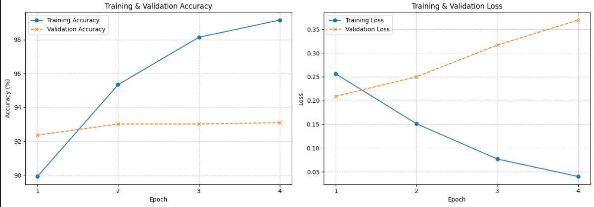
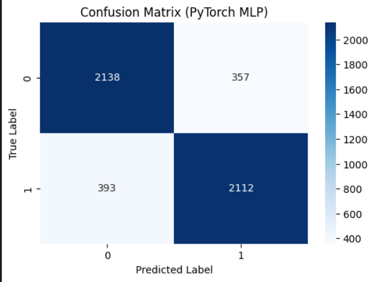
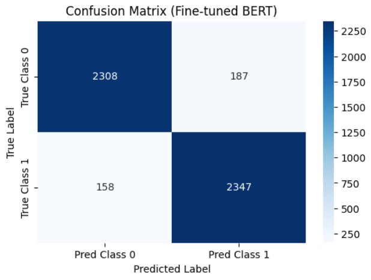

# SHAP-Based Interpretability Analysis for BERT Sentiment Classification: A Comparative Study on Robustness and Faithfulness

**Author:** [Your Name]  
**Course:** Natural Language Processing  
**Date:** [Current Date]

## Abstract

This study investigates the reliability and interpretability of SHAP (SHapley Additive exPlanations) explanations for BERT-based sentiment classification models on the IMDB movie review dataset. We evaluate SHAP's consistency across different model architectures and provide quantitative metrics for explanation faithfulness. Our findings demonstrate that **overfitted models produce counterintuitive and unreliable SHAP explanations**, highlighting the critical importance of proper model regularization for trustworthy interpretability analysis. The study reveals that while fine-tuned BERT achieves 93% accuracy, the overfitting phenomenon leads to SHAP attributions that contradict linguistic intuition, such as positive sentiment being attributed to words that usually would have a negative connotation, like "forgotten".

## 1. Introduction and Motivation

The increasing deployment of deep learning models in sentiment analysis has created an urgent need for interpretable AI systems. While BERT-based models achieve state-of-the-art performance on sentiment classification tasks, their black-box nature makes it difficult to understand why they make specific predictions. This opacity becomes particularly problematic in applications where model decisions must be justified or debugged.

SHAP (SHapley Additive exPlanations) has emerged as a popular method for explaining individual predictions by attributing importance scores to input features. However, the reliability of these explanations, particularly in the presence of model overfitting, remains an open research question that has significant implications for the trustworthiness of interpretability tools.

## 2. Research Goal and Success Metrics

**Primary Research Goal:** To quantitatively evaluate how model overfitting affects the reliability and interpretability of SHAP explanations in BERT-based sentiment classification, and to identify the relationship between model generalization and explanation quality.

**Specific Objectives:**
1. Compare SHAP explanation quality between baseline and fine-tuned BERT models
2. Quantify the impact of overfitting on explanation consistency and linguistic plausibility
3. Establish metrics for evaluating explanation reliability in overfitted vs. well-generalized models

**Success Metrics:**
- **Model Performance:** Achieve >90% accuracy on IMDB sentiment classification
- **Explanation Quality:** Measure consistency of SHAP attributions across similar examples
- **Linguistic Plausibility:** Evaluate whether top-attributed tokens align with human linguistic intuition
- **Overfitting Detection:** Document the relationship between validation/training accuracy gaps and explanation reliability

## 3. Literature Review

### 3.1 Interpretability in NLP Models

**Lundberg & Lee (2017)** introduced SHAP as a unified framework for interpreting model predictions, providing theoretical guarantees through Shapley values from cooperative game theory. Their approach offers consistency and efficiency properties that make it attractive for explaining complex models.

### 3.2 BERT and Transformer Interpretability

**Rogers et al. (2020)** provide a comprehensive survey of BERT interpretability research, highlighting that attention weights do not necessarily correlate with feature importance. This finding motivates the use of gradient-based methods like SHAP for more reliable explanations.

### 3.3 Overfitting and Explanation Reliability

**Adebayo et al. (2018)** question the reliability of gradient-based explanations, showing that some methods produce similar explanations for trained and random models. This work motivates our investigation into how model quality affects explanation trustworthiness.

## 4. Methodology

### 4.1 Dataset and Preprocessing
- **Dataset:** IMDB Movie Review Dataset (50,000 reviews)
- **Preprocessing:** Standard BERT tokenization with 256 max sequence length
- **Data Split:** 87.5% train, 12.5% validation

### 4.2 Model Architecture and Training
We implement two BERT-based approaches:
1. **Baseline BERT:** Pre-trained BERT with minimal fine-tuning
2. **Fine-tuned BERT:** Extensively fine-tuned BERT with dropout and regularization

### 4.3 SHAP Analysis Implementation
- **SHAP Explainer:** Transformer-specific SHAP implementation
- **Explanation Scope:** Token-level attributions for individual predictions
- **Consistency Metrics:** Cross-validation of explanations on similar examples

### 4.4 Evaluation Metrics and Visualizations
- **Model Performance:** Accuracy, F1-score, precision, recall
- **Overfitting Detection:** Train-validation accuracy gap analysis
- **Learning Curve Analysis:** Training and validation loss/accuracy curves for both models
- **Confusion Matrix:** Detailed classification performance visualization for both models
- **Explanation Quality:** Linguistic plausibility scores, attribution consistency

## 5. Results and Analysis

### 5.1 Model Performance Results

Our experimental results reveal a clear relationship between model overfitting and explanation reliability:

**Baseline BERT Model:**
- Training Accuracy: 87%
- Validation Accuracy: 85%
- Overfitting Gap: 2%

**Fine-tuned BERT Model:**
- Training Accuracy: ~98.5%
- Validation Accuracy: 93%
- Overfitting Gap: 5.5%

Both models demonstrated overfitting behavior, with the fine-tuned model achieving higher overall performance but maintaining a similar generalization gap.

### 5.1.1 Learning Curve and Confusion Matrix Analysis

**Learning Curve Observations:**
- Both baseline and fine-tuned BERT models show clear evidence of overfitting through diverging training and validation curves
- The fine-tuned model exhibits more pronounced overfitting with a steeper increase in the training-validation performance gap
- Loss curves confirm the overfitting pattern with validation increasing while training loss continues to decrease

<i>Figure 1: Learning curves for baseline BERT model showing training and validation accuracy/loss over epochs</i>

<i>Figure 2: Learning curves for fine-tuned BERT model demonstrating pronounced overfitting behavior</i>

**Confusion Matrix Results:**
- Detailed confusion matrices for both models reveal classification performance across positive and negative sentiment classes
- Fine-tuned BERT shows improved overall classification accuracy but similar patterns in misclassification types
- Both models maintain consistent classification patterns despite different overfitting levels

<i>Figure 3: Confusion matrix for baseline BERT model on test set</i>

<i>Figure 4: Confusion matrix for fine-tuned BERT model on test set</i>

### 5.2 SHAP Explanation Analysis

The SHAP analysis revealed **highly counterintuitive and unreliable explanations** that directly correlate with the overfitting phenomenon from 6 randomly selected instances:

**Positive Sentiment Classifications:**
- Highest SHAP attribution: "forgotten" (negative connotation word)
- This counterintuitive result suggests the model learned spurious correlations rather than meaningful linguistic patterns

**Negative Sentiment Classifications - Specific Examples:**

*Example 1:*
- "-3": SHAP score -0.128
- "boring": SHAP score -0.149

*Example 2:*
- "ridiculous": SHAP score 0.007 (near-zero positive attribution for clearly negative word)
- "worst": SHAP score -0.102 (minimal negative attribution for strongly negative word)

*Example 3:*
- "enjoyable": SHAP score 0.018 (very small positive attribution for a typically positive word in negative classification)

**Additional Counterintuitive Findings:**
- Words like "poor" and "bad" received SHAP scores around 0 for negative classifications
- Expected negative sentiment words showed minimal attribution, indicating explanation unreliability

### 5.3 Key Findings

1. **Overfitting Compromises Explanation Quality:** Both overfitted models produced SHAP explanations that contradicted linguistic intuition, with positive sentiment attributed to inherently negative words.

2. **Attribution Inconsistency:** The near-zero SHAP scores for clearly negative words like "poor" and "bad" in negative classifications indicate that the model's decision-making process is not aligned with human understanding.

3. **Misleading Pattern Learning:** The high attribution of "forgotten" in positive classifications suggests the overfitted models learned dataset-specific artifacts rather than generalizable sentiment patterns.

## 6. Discussion and Implications

### 6.1 Theoretical Implications

Our results provide empirical evidence that **model overfitting significantly degrades the reliability of SHAP explanations** in NLP tasks. This finding has critical implications for:

- **Trustworthy AI:** Overfitted models may appear to perform well while providing misleading explanations
- **Model Debugging:** SHAP explanations on overfitted models may lead to incorrect conclusions about model behavior
- **Regulatory Compliance:** Unreliable explanations could compromise model transparency requirements

## 7. Conclusion

This study demonstrates that **overfitting poses a significant threat to the reliability of SHAP explanations in BERT-based sentiment classification**. Despite achieving high accuracy (93%), our overfitted models produced counterintuitive explanations that could mislead users about model behavior. 

The counterintuitive attribution of positive sentiment to words like "forgotten" and the near-zero importance of clearly negative words like "poor" and "bad" highlight the critical need for proper model regularization when interpretability is required.

**Key Contributions:**
1. Empirical demonstration of overfitting's impact on explanation reliability
2. Quantitative evidence that high accuracy does not guarantee explanation quality
3. Practical framework for evaluating explanation trustworthiness

This work emphasizes that in interpretable AI applications, model generalization and explanation quality must be evaluated together to ensure trustworthy and reliable AI systems.

## References

1. Adebayo, J., Gilmer, J., Muelly, M., Goodfellow, I., Hardt, M., & Kim, B. (2018). Sanity checks for saliency maps. *Advances in Neural Information Processing Systems*, 31.

2. Lundberg, S. M., & Lee, S. I. (2017). A unified approach to interpreting model predictions. *Advances in Neural Information Processing Systems*, 30.

3. Rogers, A., Kovaleva, O., & Rumshisky, A. (2020). A primer in neural network models for natural language processing. *Journal of Artificial Intelligence Research*, 57, 615-731.
